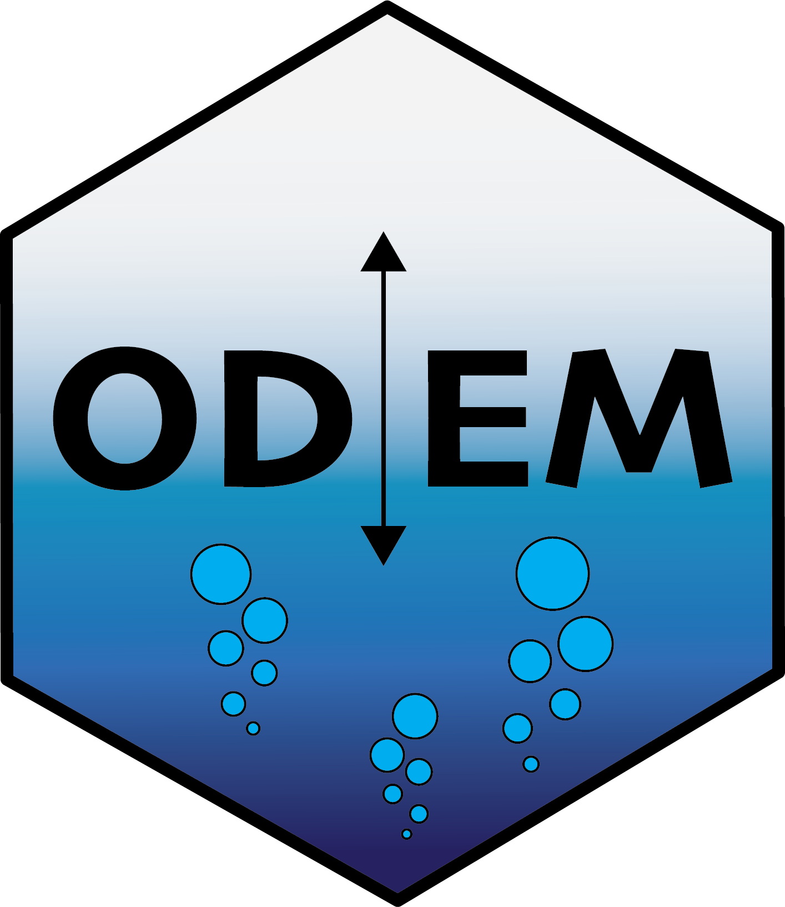

<a href="url"></a>
# odem.data

Data processing for classifying regional DO consumption patterns through the Oxygen DEpletion Model (ODEM)

## Installation

```r
remotes::install_github("LimnoDataScience/odem.data")
```

## Usage

```R
# build odem input data and run model for a specific lake using R
lake_id <-  "nhdhr_34132539"
source("analysis/scripts/01_data_merge_sql.R")
```

```bash
# or build odem input data for a specific lake using the command line
make analysis/data/143249470_Mendota/input.txt

# build odem input data for all lakes using the command line
make all

# or run calibration of all possible lakes via terminal
Rscript analysis/scripts/run_lakes.R
```

## Data

### Input data

 * temperature: `pball_*_temperatures.csv`

 * meteorology: `NLDAS_*.csv`

 * water quality data from LTER: `wq_data_*.csv`

 * nml file : `nhdhr_*.nml`

### Output data for odem

|variable                 |
|:-----------------|
|datetime          |
|thermocline_depth |
|temperature_epi   |
|temperature_hypo  |
|temperature_total |
|volume_total      |
|volume_epi        |
|volume_hypo       |
|area_thermocline  |
|area_surface      |
|upper_meta        |
|lower_meta        |
|year              |
|day_of_year       |
|max.d             |
|wind              |
|airtemp           |

-----

This R-package is still under development and functions are likely to change with future updates. `odem.data` is maintained by UW-Madison Center for Limnology. All data were obtained from online repositories, e.g. NTL-LTER and the USGS Water Quality Portal. This project is part of the Data Science Initiative at UW-Madison.
